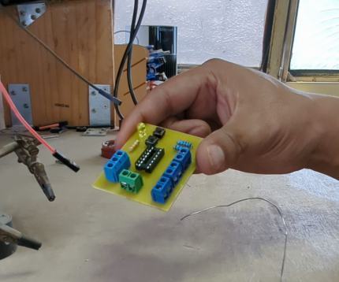

# Probador de Compuertas Lógicas (Familia 74LS) 🔌

Este proyecto consiste en una PCB de una sola cara diseñada para verificar de manera rápida y visual el funcionamiento de circuitos integrados de la familia lógica **74LS** (como 74LS08, 74LS32, 74LS00, etc.).

  

## 📝 Descripción
La placa permite insertar un circuito integrado en un zócalo central y manipular sus entradas mediante botones o puentes, observando la respuesta lógica a través de un indicador LED. Es una herramienta ideal para aprendizaje de electrónica digital y para validar integrados antes de usarlos en proyectos más complejos.

## 🛠️ Especificaciones Técnicas
- **Tipo de PCB:** Una sola cara (Single Layer).
- **Compatibilidad:** Circuitos integrados DIP de la familia 74LS.
- **Componentes destacados:**
  - Terminales de bloque para alimentación y señales externas.
  - Resistencias de pull-up/pull-down para estados lógicos definidos.
  - Indicador visual LED para el estado de salida.
  - Pulsadores para interacción directa.

## 🚀 Proceso de Fabricación
Al igual que otros proyectos en este perfil, esta placa fue diseñada pensando en la fabricación artesanal y técnica:
1. **Diseño:** Esquemático y ruteado optimizado para una cara.
2. **Fabricación:** Procesada mediante **CNC Milling**.
3. **Acabado:** Soldadura manual y pruebas de continuidad.

---
*Diseñado y fabricado por **MaCa** en el taller Zeus 🚌💻*
